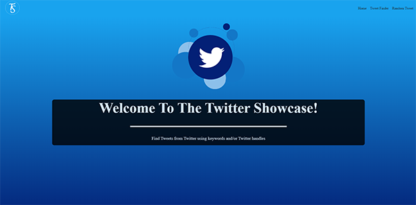

# Twitter Showcase

> This documentation is for my Twitter Search Showcase app. An app designed to search for Tweets using keywords and also a showcase of 5 of my favorite Twitter users that displays a random Tweet from them with the click of a button.

The project was bootstrapped with [Create React App](https://github.com/facebook/create-react-app).<br>
To view live on Heroku <a href="https://showcase-tweets.herokuapp.com" target="_blank">CLICK HERE</a>.

</img>

&nbsp;&nbsp;
&nbsp;&nbsp;
&nbsp;&nbsp;
&nbsp;&nbsp;
&nbsp;&nbsp;
&nbsp;&nbsp;


### Technical Information:

-   Front End (JavaScript)
    -   React (main SPA)
    -   Axios (HTTP requests)
-   Back End (Node)
    -   Express (Serving static site, internal API endpoints)
    -   Axios (HTTP requests)
-   Hosts
    -   Heroku

## Installation Instructions:

### Install React-App

-   From the root directory, run: `npm install`
-   cd into /client and run: `npm install`
-   once installed, to start the application, from the root directory run: `npm run dev`

### Obtaining Needed API Keys

-   To run Twitter Showcase from your local computer, you need to sign up for a [Twitter developer account](https://developer.twitter.com)
-   Once logged in to your developer account, select Apps from the dropdown menu next to your name in the upper right-hand corner.
-   Select 'Create an app' button and fill out the requested information.
-   Once your app has been created, select the 'Details' button and choose the 'Keys and tokens' tab.
-   On the 'Keys and tokens' tab, you will find your Consumer API keys. Copy these keys to their respective variables in the `.env` file like so:

```
REACT_APP_TWITTER_CONSUMER_KEY={CONSUMER_KEY}
REACT_APP_TWITTER_SECRET_KEY={SECRET_KEY}
REACT_APP_TWITTER_BEARER_TOKEN={BEARER_TOKEN}
```

### Resources Used

-   <a href="https://www.udemy.com/modern-react-front-to-back/" target="_blank">Udemy - React Front To Back 2019 by Brad Traversy</a>
-   <a href="https://scrimba.com/g/glearnreact" target="_blank">Scrimba - Learn React for free</a>
-   <a href="https://developer.twitter.com/en/docs.html" target="_blank">Twitter API Documentation</a>
-   <a href="https://www.npmjs.com/package/axios" target="_blank">Axios project page</a>
